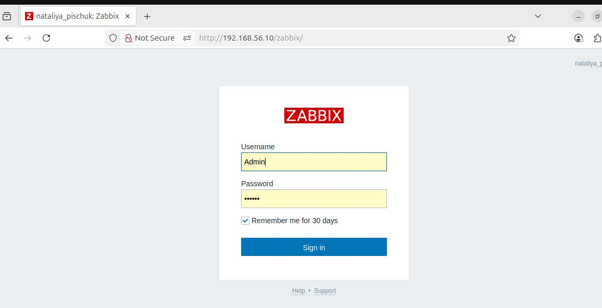
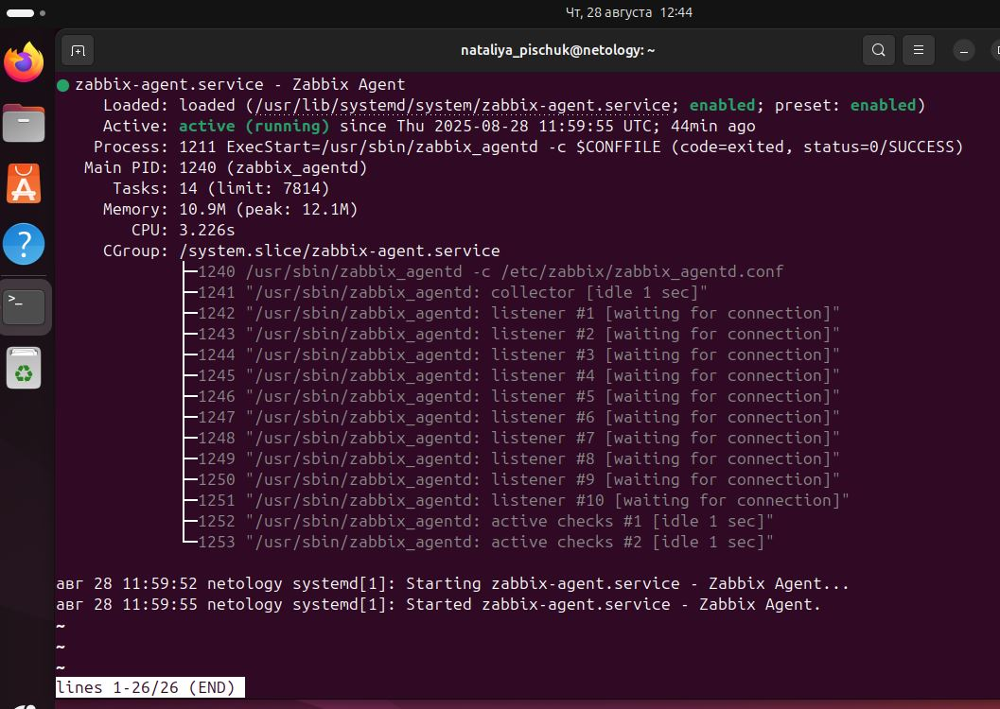
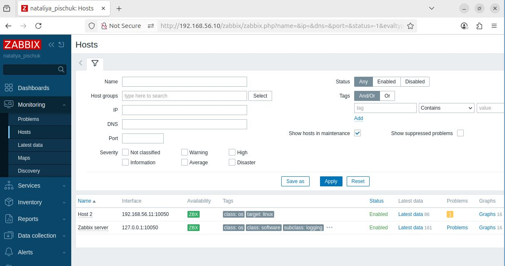
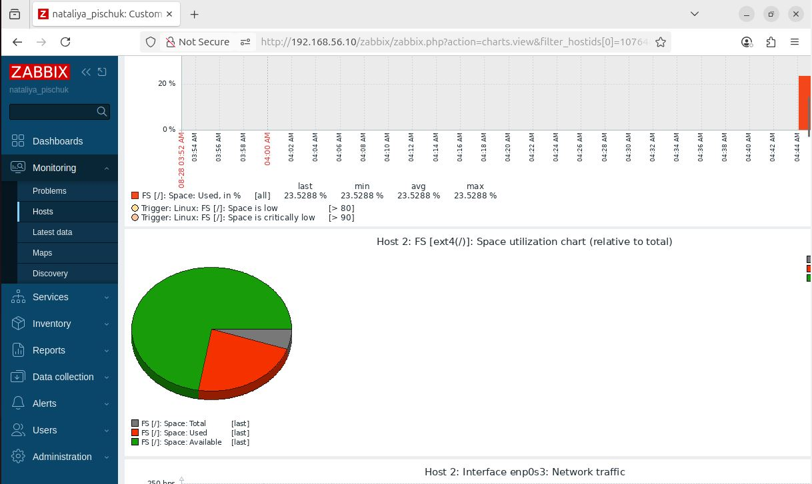

# Домашнее задание к занятию «Система мониторинга Zabbix»
Пищук Наталья Владимировна

### Инструкция по выполнению домашнего задания

   1. Сделайте `fork` данного репозитория к себе в Github и переименуйте его по названию или номеру занятия, например, https://github.com/имя-вашего-репозитория/git-hw или  https://github.com/имя-вашего-репозитория/7-1-ansible-hw).
   2. Выполните клонирование данного репозитория к себе на ПК с помощью команды `git clone`.
   3. Выполните домашнее задание и заполните у себя локально этот файл README.md:
      - впишите вверху название занятия и вашу фамилию и имя
      - в каждом задании добавьте решение в требуемом виде (текст/код/скриншоты/ссылка)
      - для корректного добавления скриншотов воспользуйтесь [инструкцией "Как вставить скриншот в шаблон с решением](https://github.com/netology-code/sys-pattern-homework/blob/main/screen-instruction.md)
      - при оформлении используйте возможности языка разметки md (коротко об этом можно посмотреть в [инструкции  по MarkDown](https://github.com/netology-code/sys-pattern-homework/blob/main/md-instruction.md))
   4. После завершения работы над домашним заданием сделайте коммит (`git commit -m "comment"`) и отправьте его на Github (`git push origin`);
   5. Для проверки домашнего задания преподавателем в личном кабинете прикрепите и отправьте ссылку на решение в виде md-файла в вашем Github.
   6. Любые вопросы по выполнению заданий спрашивайте в чате учебной группы и/или в разделе “Вопросы по заданию” в личном кабинете.
   
Желаем успехов в выполнении домашнего задания!
   
### Дополнительные материалы, которые могут быть полезны для выполнения задания

1. [Руководство по оформлению Markdown файлов](https://gist.github.com/Jekins/2bf2d0638163f1294637#Code)

---

### Задание 1 

Задание 1
Создайте свой шаблон, в котором будут элементы данных, мониторящие загрузку CPU и RAM хоста.

Процесс выполнения
Выполняя ДЗ сверяйтесь с процессом отражённым в записи лекции.
В веб-интерфейсе Zabbix Servera в разделе Templates создайте новый шаблон
Создайте Item который будет собирать информацию об загрузке CPU в процентах
Создайте Item который будет собирать информацию об загрузке RAM в процентах
Требования к результату
 Прикрепите в файл README.md скриншот страницы шаблона с названием «Задание 1»

#### Задание 1

---
# Задание 2
Установите Zabbix Agent на два хоста.

Процесс выполнения
Выполняя ДЗ, сверяйтесь с процессом отражённым в записи лекции.
Установите Zabbix Agent на 2 вирт.машины, одной из них может быть ваш Zabbix Server.
Добавьте Zabbix Server в список разрешенных серверов ваших Zabbix Agentов.
Добавьте Zabbix Agentов в раздел Configuration > Hosts вашего Zabbix Servera.
Проверьте, что в разделе Latest Data начали появляться данные с добавленных агентов.

# Решение
Клонировала свою виртуальную машину со всеми действующими настройками и установила связь между ними
На обеих машинах выполнила следующие действия:

sudo -s
Добавления репозитория
wget https://repo.zabbix.com/zabbix/7.4/release/ubuntu/pool/main/z/zabbix-release/zabbix-release_latest_7.4+ubuntu24.04_all.deb
dpkg -i zabbix-release_latest_7.4+ubuntu24.04_all.deb

установка Zabbix агента
apt install zabbix-agent

Запуск процесса Zabbix агента и настройка его.

systemctl restart zabbix-agent
systemctl enable zabbix-agent

Корректировка файла zabbix_agentd.conf:

### Результат

---
